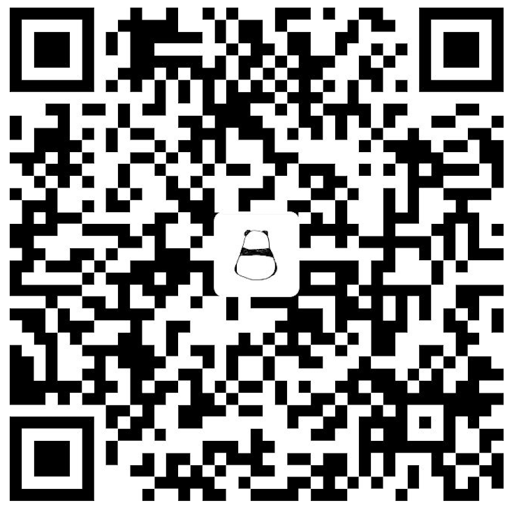

# web-capture

## 依赖库&编译工具

* ffmpeg-3.4.8
* emscripten-2.0.21

## 支持编码

* H.264
* H.265
* Mpeg2
* Mpeg4
* VP8
* VP9

## 支持格式

* Mkv
* Mov
* Avi
* Mp4
* Webm

## 注意事项

* 建议基于 `Ubuntu` 系统进行编译安装，已知 `Windows`、`Mac`都会出现各种文件丢失和环境不一致导致的问题

* 编译前需要下载 [ffmpeg-3.4.8.tar.xz](http://ffmpeg.org/releases/ffmpeg-3.4.8.tar.xz) 并解压至与 `web-capture` 同级的目录

* `emsdk` 安装目录需要与 `web-capture` 同级


## demo运行

```
npm install

npm run server

http://localhost:3000/demo/index.html

```

## 使用

可以参考 `demo/index.html`, 示例如下

```js

 window.webCapture.capture(file, timeInput.value * 1000, (dataURL, imageInfo) => {

    const { width, height, duration } = imageInfo;

    resultContainer.innerHTML = ``

    infoContainer.innerHTML = `耗时：${Date.now() - startTime}ms<br>宽度：${width}<br>高度：${height}<br>时长：${duration / 1000000}s`;
})

```

## 本地编译

```
npm run build
```

通过 npm run build 编译项目，最终产物在 dist 目录下

## 项目赞助

觉得有帮助可以赞助作者更好维护此项目~

* 支付宝



* 微信支付


## 参考文章

https://www.jianshu.com/p/d08c0cff8a77
https://juejin.im/entry/5afd7963f265da0ba3524439
http://dranger.com/ffmpeg/tutorial01.html
https://zhuanlan.zhihu.com/p/40786748
https://blog.csdn.net/shixin_0125/article/details/106937186
https://www.cnblogs.com/renhui/p/6922971.html
https://cloud.tencent.com/developer/article/1393972
https://www.jianshu.com/p/3c95b0471d3a

